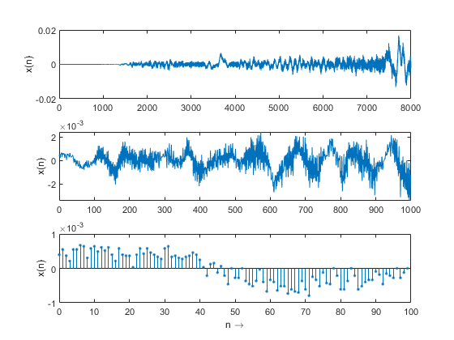
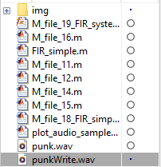
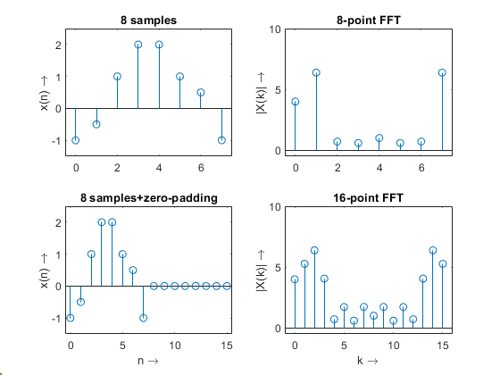
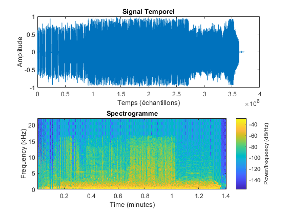

# DAFX_Algorithms
all algorithms of DAFX book 2nd edition

Almost all the scripts written in this book are no longer operational in the new versions of matlab. Here are all the updated scripts.

Music use : [punk.wav](punk.wav)
## Chapter 1 : Introduction

